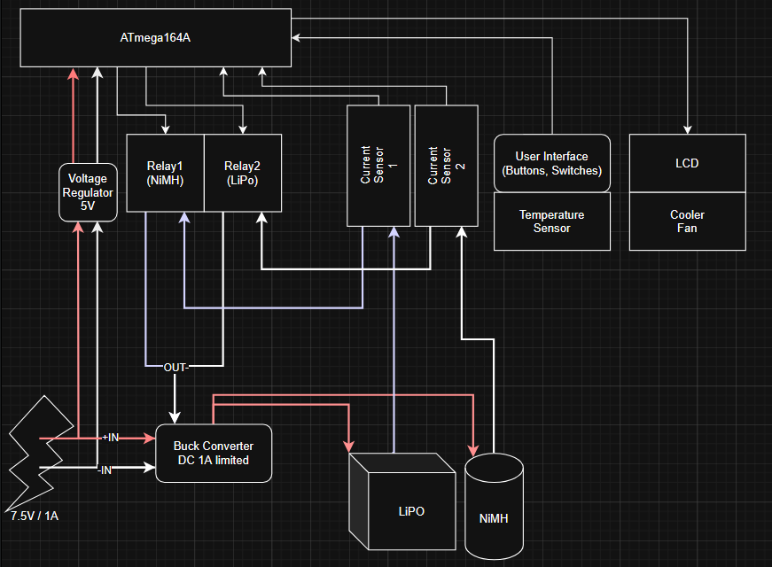

# 🔋 ATmegaCharger

Smart LiPo and NiMH battery charger using ATmega164A microcontroller.

## What it does

- Charges LiPo (4.2V) and NiMH (1.2V) batteries safely
- LCD display shows voltage, current, temperature
- Auto-stop with multiple safety protections

## Hardware

- ATmega164A microcontroller
- Power MOSFET + current sense resistor
- 16x2 LCD + push buttons
- Temperature sensor (NTC)

## Charging Methods

**LiPo:** CC-CV (constant current → constant voltage)  
**NiMH:** CC with -ΔV termination (voltage drop detection)
